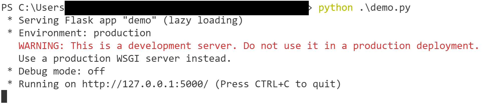
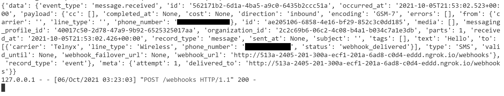

# SMS Auto-responder App
 Learn how to built a custom SMS Auto responder application using [Python programming language](https://www.python.org/), [Telnyx APIs](https://telnyx.com) and [ngrok](https://ngrok.com/). 

 ## Architecture
 
 
 
1. User sends an SMS from phone to a number procurred from Telnyx
1. Telnyx receives the message and hands it to ngrok webhook
1. Ngrok receives it and hands the data to flask aapplication
1. Flask application reads the message, evaluates it and responds to user's number
1. Telnyx number sends response to user's number as a text message from flask application

## Prerequisite

 * Python installed (https://www.python.org/downloads/) 
 * Telnyx Developer Account (https://developers.telnyx.com/)
 * Ngrok (https://dashboard.ngrok.com/signup)
 * Code IDE or text Editor
 * terminal or shell or command prompt

 ## Steps

 ### Step 1: Telnyx Setup
 You need to sign up for Telnyx account, obtain a number with SMS capabilities and configure the number for messaging.
 <details>
<summary><strong>Steps to follow</strong> (click to expand)</summary><p>

 1. Sign up for Telnyx account
    > Set up a developer account with Telnyx from https://telnyx.com/sign-up.

 2. Obtain a number with SMS capabilities for auto-responder app
    > After creating an account and signing in, you need to [acquire a number](https://portal.telnyx.com/#/app/numbers/search-numbers) for the application. Search for a number by selecting your preferred 'Region' or 'Area Code'.
    
    > Make sure that the number supports SMS feature(Very Important!) as it will be used by our application.
 
 3. Create a messaging profile
    > Next create a [messaging profile](https://portal.telnyx.com/#/app/messaging) by clicking on "Add new profile" and provide a suitable profile name to it(you do not need to provide any other detail for now).

 4. Configure the number for messaging
    > Go to the [numbers](https://portal.telnyx.com/#/app/numbers/my-numbers) page, look for the number you created and set the number's `Messaging Profile` to the profile you created in the previous step. 
    
    <details>
    <summary>What if the Telnyx number is an international number for a User</summary>
    <br>    
    
    > If you want to send the message to a Telnyx number which is not in the country where you are, then you need to click on the 'Routing' option.
     
    
    > After clicking on 'Routing', a dialog box will open. In there, select the traffic type as "P2P" to allow International Inbound and Outbound SMS deliverability. And do not forget to save the changes!  

      
    </details>
    
 5. Acquire Telnyx API key
    > Go to the [API Keys](https://portal.telnyx.com/#/app/api-keys) page and copy the API Key for the future steps. Incase there is no API Key, then create one.

</p></details>

___

### Step 2: Install and configure ngrok
A tunneling tool is required to provide internet access to Python Flask application. You need to sign-up for ngrok account, download the setup file and edit Telnyx messaging profile to add a webhook.

<details>
<summary><strong>Steps to follow</strong> (click to expand)</summary><p>

 1. Sign up for ngrok account and download the setup file
    > Go to https://dashboard.ngrok.com/signup and create an account.

 2. Obtain the ngrok setup file and follow the steps mentioned
    > Download the ngrok setup file as per your OS from https://dashboard.ngrok.com/get-started/setup and follow the steps mentioned on the page.
    
    > You need to run the setup file (It has zero run-time dependencies!)
    
    > In the `Step 3`, you need to change the command to
     ``` shell
    ngrok http 5000
    ```
    > After running the above command, you would see something similar to following:
    
     

    > Copy the highlighted 'Forwarding' address. we will need it in next step. 

    ``` shell
    http://0ab4-2405-201-300a-ecf1-201a-6ad8-c0d4-eddd.ngrok.io
    ```
 3. Edit Telnyx messaging profile to add webhook
    
    > Go to [messaging profile](https://portal.telnyx.com/#/app/messaging) and click on the message profile you created earlier.

    > It will open "Edit Messaging Profile" page, here under "Inbound Settings" you need to provide value to 'Send a webhook to this URL' 

    > The value is Forwarding address we copied in the previous step. Append it with '/webhooks'. It will look like this -

    ``` shell
    http://0ab4-2405-201-300a-ecf1-201a-6ad8-c0d4-eddd.ngrok.io/webhooks
    ```
    

    > **Always keep the ngrok process running, do not stop it or restart it!** Because it will lead to a changed URL, which then will require you to repeat the above steps each time.
    
</p></details>

___

### Step 3: Python setup and code
Flask, a micro web framework written in Python, is one of the easiest web framework to work with. You need to create a Flask app, receive messages in application from user and send the response to user based on pre-defined conditions.
<details>
<summary><strong>Steps to follow</strong> (click to expand)</summary><p>

 1. Setup and dependencies
    > A [Flask](https://flask.palletsprojects.com/en/2.0.x/) application is required to receive the message by accepting the webhook request. You can install Flask by running following command in shell or terminal or command prompt
    ``` shell
    pip install Flask
    ```

    > Install [Telnyx Python library](https://github.com/team-telnyx/telnyx-python) for sending the message to users from the Flask application using Telnyx API. 
      ``` shell
    pip install --upgrade telnyx
    ```

 2. Receiving messages in Flask app
    > You need to create a Python file(I have named mine as demo.py) and write Flask code template in it.
      ``` python
    from flask import Flask, request
    
    app = Flask(__name__)

    @app.route('/webhooks', methods=['POST'])
    def webhooks():    
        payload = request.json
        print(payload)
        return 'success', 200

    if __name__ =="__main__":
    app.run(port=5000)
    ```
    > Run the code with following command:
      ``` shell
    python demo.py
    ```        
    > You will get something like this:
    

    > You must notice few intresting things in the code, we have defined the path as `/webhooks` and specified that the path will respond to the HTTP `POST` method. This route will accept webhooks from Telnyx when your Telnyx number receives an SMS. 

    > We have a `payload` object reading the data coming in from the webhooks.

    > You can test the code by sending an SMS from your mobile device to Telnyx number. When you send a message (say 'Hello'),you will receive detailed response on your terminal or shell or command prompt.
    

3. Sending an SMS response to user
    > You need to import Telnyx package to send the SMS to user
      ``` python
    import telnyx
    ```

    > Telnyx API Key acquired in previous steps will be used along with the procurred Telnyx number. If you have not, copy the number from [Numbers](https://portal.telnyx.com/#/app/numbers/my-numbers) screen and provide the values in python code by replacing `YOUR_API_KEY` with Telnyx API key and `YOUR_TELNYX_NUMBER` with procurred Telnyx number.

      ``` python
    telnyx.api_key = "YOUR_API_KEY" 
    telnyx_number = 'YOUR_TELNYX_NUMBER'
    ```

    > You need to edit the `Webhooks` method to read the necessary part of the response and also restrict it to only respond to inbound messages
      ``` python
    def webhooks():
    payload = request.json['data']['payload']
    if payload['direction'] == 'inbound':
        takeAction(payload)
    return 'success', 200
    ```
    > In the above code, you will notice that a new method is defined `takeAction` that takes `payload` as an argument. This method is where Flask app is responding to the incoming messages.
      ``` python
    def takeAction(payload):
        incomingText    = payload['text']
        incomingNumber  = payload['from']['phone_number']
    
        reply = calculateReply(incomingText)
    
        telnyx.Message.create(
        from_ = telnyx_number,
        to = incomingNumber,
        text = reply,
        )
    ``` 
    > The values of `incomingText` and `incomingNumber`are extracted from the response received as payload. And it is passed to the `telnyx.Message.create` with the messsage(reply). `telnyx.Message.create` is a part of the Telnyx Python library which has made sending messages easy.

    > In the above code, if you replace `calculateReply(incomingText)` with your own text string(say 'Hi from Flask app!'), it will work perfectly and will only send fixed message. But we need to built an application that responds after meeting certain criteria. You need to include following code:
    ``` python
    def calculateReply(incomingText):
        if(incomingText.lower() == 'ice cream'):
            reply = "I prefer gelato"
        elif(incomingText.lower() == 'pizza'):
            reply = "Chicago pizza is the best"
        else:
            reply = "Please send either the word 'pizza' or 'ice cream' for a different response"
        return reply 
    ```
    >  In the above code, `calculateReply` method takes `incomingText` as an argument and compares it with `ice cream` and `pizza` strings. On the basis of whether `incomingText` matches or not, application sends a pre-determined response to the user.

4. Testing the complete application
    > You can test it with your own mobile device, all you need to do is text one of the following values to your Telnyx number:
    ``` shell
    pizza
    ice cream
    burger
    ```
    > If everything is working well, you should see following response:
     

</p></details>

___

**Congratulations! You have created your own SMS Auto Responder App**