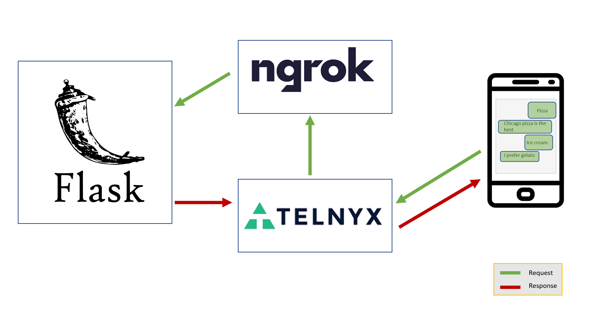

# SMS Auto-responder App
 Learn how to built a custom SMS Auto responder application using [Python programming language](https://www.python.org/), [Telnyx APIs](https://telnyx.com) and [ngrok](https://ngrok.com/). 

 ## Architecture
 The Python flask application responds to the food choices of a user 

 
 

