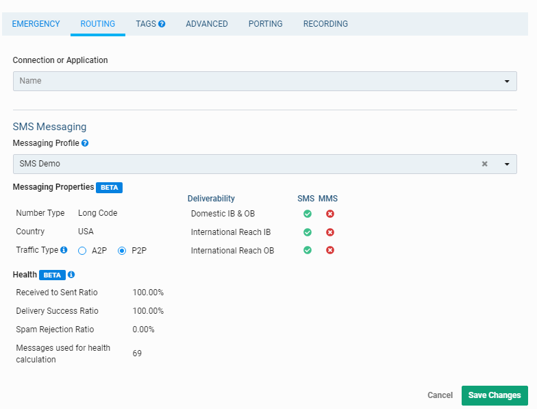

# SMS Auto-responder App
 Learn how to built a custom SMS Auto responder application using [Python programming language](https://www.python.org/), [Telnyx APIs](https://telnyx.com) and [ngrok](https://ngrok.com/). 

 ## Architecture
 
 
 
1. The user sends the text message to a number procurred from Telnyx
1. Telnyx receives the message and hands it to ngrok webhook
1. Ngrok webhook hands the data to flask aapplication
1. Flask application reads the message, evaluates it and responds to users number
1. Telnyx number sends response to users number as text message from flask application

## Prerequisite

 * Python installed (https://www.python.org/downloads/) 
 * Telnyx Developer Account (https://developers.telnyx.com/)
 * Ngrok (https://dashboard.ngrok.com/signup)
 * Code IDE or text Editor
 * terminal or shell or command prompt

 ## Steps

 ### Step 1: Telnyx Setup
 
 

<strong>Steps to follow</strong> (click to expand)

 1. Sign up for Telnyx account
    > Set up a developer account with Telnyx from https://telnyx.com/sign-up.

 2. Obtain a number with SMS capabilities for auto-responder app
    > After creating an account and signing in, you need to [acquire a number](https://portal.telnyx.com/#/app/numbers/search-numbers) for the application. Search for a number by setting 'Region' or 'Area Code' of your preference. 
    
    > Make sure that the number supports SMS feature(Very Important!) as it will be used by our application.
 
 3. Create a messaging profile
    > Next create a [messaging profile](https://portal.telnyx.com/#/app/messaging) by clicking on "Ass new profile" and provide a suitable profile name to it(you do not need to provide any other detail for now).

 4. Configure the number for messaging
    > Go to the [numbers](https://portal.telnyx.com/#/app/numbers/my-numbers) page, look for the number you created and set the number's `Messaging Profile` to the profile you created in the previous step. 
    
    

    
If the Telnyx number is an international number for User

         
    
    > If you want to send the message to a Telnyx number which is not in the country where you are, you will need to click on the 'Routing' option.
     
    
    > Once you click on 'Routing' a pop up will open. Select traffic type as "P2P" to allow International Inbound and Outbound SMS deliverability. And do not forget to save the changes!  

      
    

    
 5. Acquire Telnyx API key
    > Go to the [API Keys](https://portal.telnyx.com/#/app/api-keys) management screen and copy the API Key for a future step! If an API Key is not there, then create one!

___

### Step 2: Install and configure ngrok

